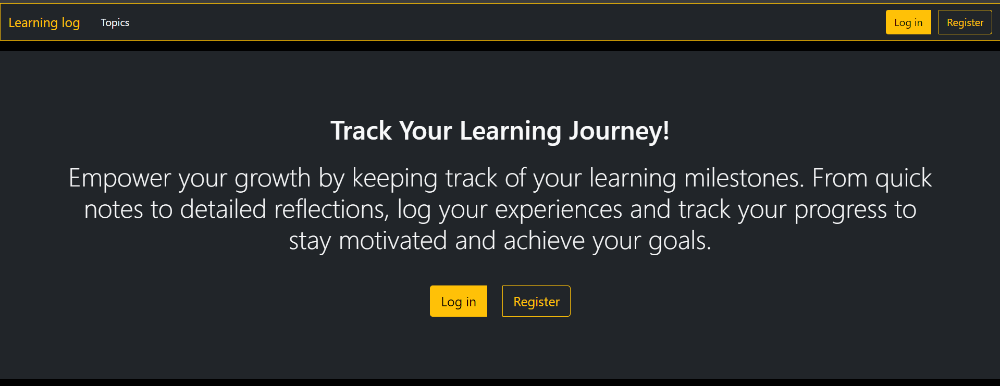
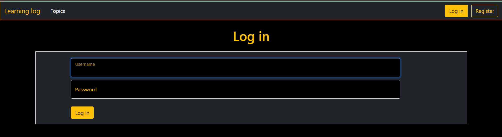
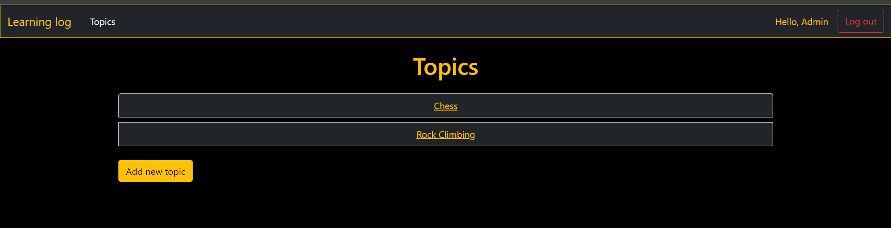
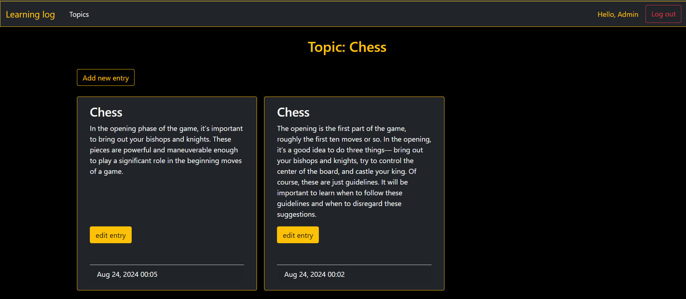

# Learning Log

## Table of contents

- [Overview](#overview)
- [Installation](#installation)
- [Features](#features)
- [Screenshots](#screenshots)
- [Technologies](#technologies)

## Overview

Learning Log is a Django application that allows users to track their learning progress. Users can create topics and add entries to each topic to document what they have learned.

## Installation

Navigate to the project directory:

```bash
  cd  Learning-Log
```

Create a virtual environment and activate it:

    ```bash
    python -m venv ll_env
    source ll_env/bin/activate  # On Windows use `ll_env\Scripts\activate`
    ```

Install the dependencies:

    ```bash
    pip install -r requirements.txt
    ```

Apply the migrations:

    ```bash
    python manage.py migrate
    ```

Create a superuser:

    ```bash
    python manage.py createsuperuser
    ```

Start the development server:

    ```bash
    python manage.py runserver
    ```

Open your browser and visit `http://localhost:8000` to view the application.

## Features

- User authentication (registration, login, logout).
- Create and read topics.
- Create, read and update entries within topics.
- Responsive design for seamless viewing on various devices.

## Screenshots

<br>
<br>
<br>
<br>

## Technologies

- Python
- Django
- HTML5
- Bootstrap
